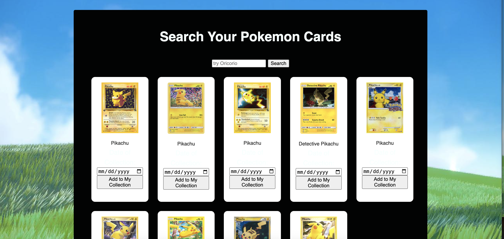
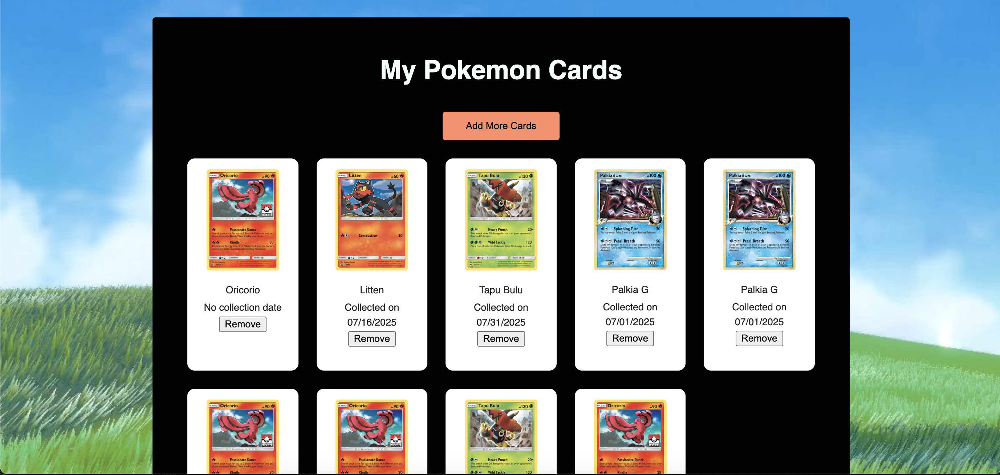

# Pokemon Collection Library

This web app serves as a personal collection to help players save their Pokémon cards under an online account. It uses the Pokémon TCG API to search for cards, and allows users to add or remove cards from their collection.

Take a peek at the [live site](https://pokemon-li-e6ae74dd2128.herokuapp.com/)!

# Features

- Signup & login
- Secure password hashing
- Search Pokémon cards by name
- Add/remove cards to/from your collection
- Save the card collection date

# Technologies Used

- Handlebars to render pages
- MySQL for database management
- Heroku for App deployment
- Pokémon TCG API

# Screenshots

